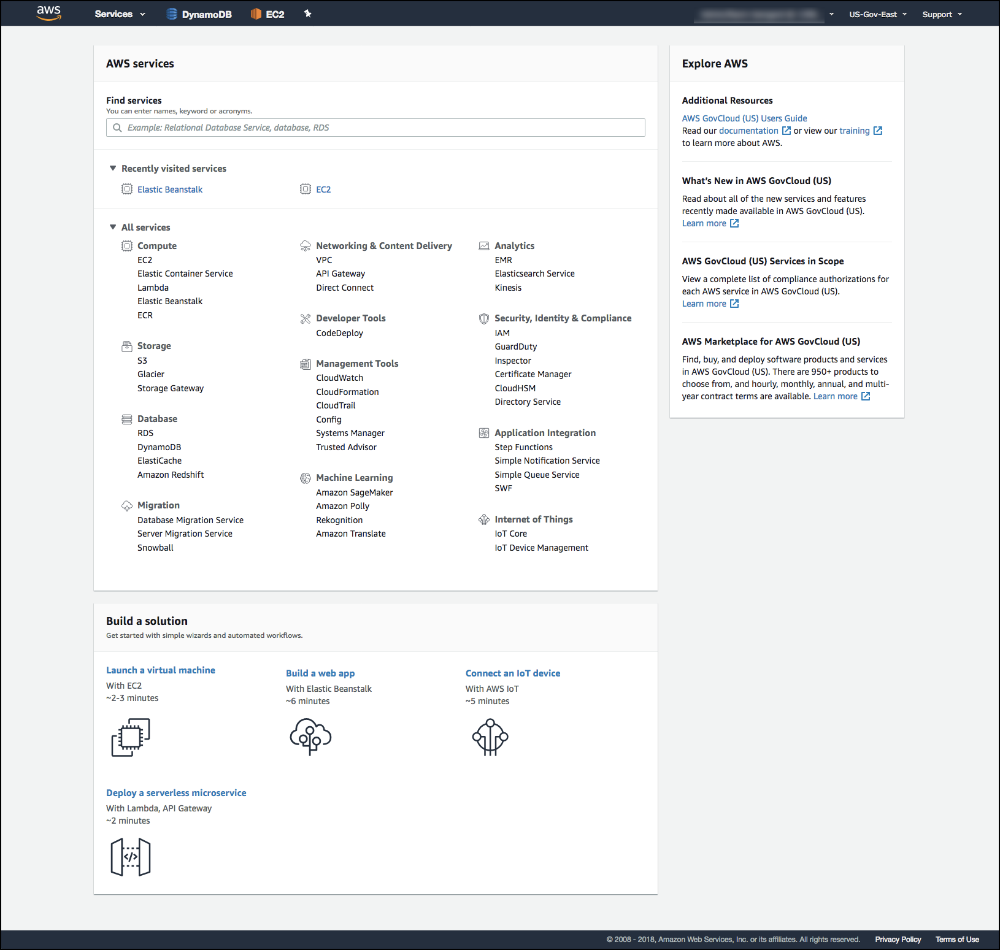

# AWS for Dummies
The following is a guide explaining commonly used AWS services in Layman's terms created to help HackRu competitors. 

## Storage/Databases
### Simple Storage Service (S3)
S3 is as simple as you think. You can just upload files or transfer files from one location into S3. In the Amazon S3 console, you can create _buckets_ which organize the data you want to store. For example, let's say you want to create a bucket called "Food" and another bucket called "Drinks". Within the food bucket, you can organize your data into folders such as "Grains", "Vegetables", etc... 

### Redshift
Redshift is an **Analytical Database**. This means you want to store data in this database for you to analyze later, not data for your service to use. For example, if your service is an online shopping service, you would store customer purchase history using Redshift. However, you should not store data you need to access in real time for your service such as user login information because accessing the data would be too slow.

### Aurora
Aurora is a **Relational, Transactional Database**. This means that you want to store well-structured data (organized in a data model) in a SQL database that needs to be accessed while your service is being used. 

### DynamoDB
DynamoDB is a **Non-relational, Transactional Database**. This means you want to store semi-structured data (such as JSON, XML) in a NoSQL database that needs to be accessed while your service is being used.

## Management Tools
### AWS Management Console
The AWS Management Console is essentially the home page on the AWS website for your AWS account. You can manage all the AWS services you use by checking their costs as well as easily accessing them from the Management Console.

### Cloudwatch
Cloudwatch collects 

## Analytics
### Elasticsearch/Logstash/Kibana
Elasticsearch is a search engine that stores and indexes your data so you can simply write a search for keywords and receive relevant information. It is typically paired with Logstash and Kibana, making the ELK (Elasticsearch, Logstash, Kibana).

Logstash is a data transfer pipeline that can transfer data from specified locations into Elasticsearch or vice versa. It can move data from S3, Cloudwatch, and more into Elasticsearch. To see what data sources Logstash can connect to, tead the documentation [here](https://www.elastic.co/guide/en/logstash/current/input-plugins.html). 

Kibana is the front-end user interface individuals can use to interact with Elasticsearch. You can enter keywords in a search bar and get all relevant information you stored in Elasticsearch back. Additionally, you can create graphics and charts in Kibana to get a visualization of the data you are working with. 

## Compute
### Elastic Compute Cloud (EC2)
In simple terms, EC2 allows you to create _instances_ of a computer online. They aren't exactly like the computers you use everyday, but rather they provide cloud computing power. For example, let's say you created a sudoku game application on your computer. It's only running locally on your computer at the moment, so only you can access it. But if you want other people to access your game, you can run the sudoku application on an EC2 instance so it can be accessed by anyone who has permission to access it. 

### Lambda
Lambdas are a good way to run code ONLY for specific scenarios. You write your code in the lambda console on the AWS website (or upload onto the lambda console) and you can set a trigger for the lambda so that it only runs when triggered. For example, we can have code in the lambda to transfer data from one S3 bucket called Bucket1 to another S3 bucket called Bucket2. The lambda's trigger then would be whenever Bucket1 is updated with more files. Thus, if you upload a file into Bucket1, this triggers the lambda which will then transfer the files over to Bucket2. 

Lambdas are a great way to transfer data from one place to another if you're working with batch data (that is, the data you're working with comes in batches such as once a day or once a week). It's a cheaper alternative than using a stream that's running 24/7 to stream data into a storage service because there's no need to have a stream running for the whole day when you only get data once during the day! 

### Virtual Private Cloud (VPC)

## Security
### AWS Identity and Access Management (IAM)

### Amazon Cognito

### AWS Key Management Service
