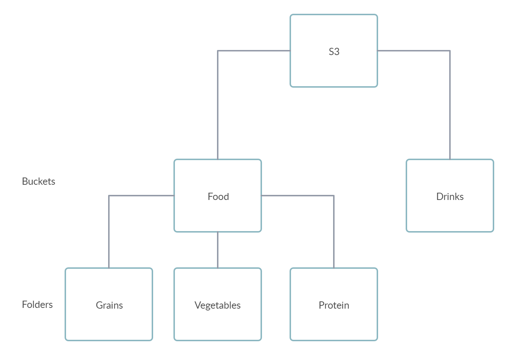

# AWS for Dummies
The following is a guide explaining commonly used AWS services in Layman's terms created to help HackRu competitors. 

## Storage/Databases
### Simple Storage Service (S3)
S3 is as simple as you think. You can just upload files or transfer files from one location into S3. In the Amazon S3 console, you can create _buckets_ which organize the data you want to store. For example, let's say you want to create a bucket called "Food" and another bucket called "Drinks". Within the food bucket, you can organize your data into folders such as "Grains", "Vegetables", etc... 

### Redshift
Redshift is an **Analytical Database**. This means you want to store data in this database for you to analyze later, not data for your service to use. For example, if your service is an online shopping service, you would store customer purchase history using Redshift. However, you should not store data you need to access in real time for your service such as user login information because accessing the data would be too slow.

### Aurora
Aurora is a **Relational, Transactional Database**. This means that you want to store well-structured data (organized in a data model) in a SQL database that needs to be accessed while your service is being used. 

### DynamoDB
DynamoDB is a **Non-relational, Transactional Database**. This means you want to store semi-structured data (such as JSON, XML) in a NoSQL database that needs to be accessed while your service is being used.

## Management Tools
### Cloudwatch

### AWS Management Console

## Analytics
### Elasticsearch/Logstash/Kibana
Elasticsearch is a search engine that stores and indexes your data so you can simply write a search for keywords and receive relevant information. It is typically paired with Logstash and Kibana, making the ELK (Elasticsearch, Logstash, Kibana).

Logstash is a data transfer pipeline that can transfer data from specified locations into Elasticsearch or vice versa. It can move data from S3, Cloudwatch, and more into Elasticsearch. To see what data sources Logstash can connect to, tead the documentation [here](https://www.elastic.co/guide/en/logstash/current/input-plugins.html). 

Kibana is the front-end user interface individuals can use to interact with Elasticsearch. You can enter keywords in a search bar and get all relevant information you stored in Elasticsearch back. Additionally, you can create graphics and charts in Kibana to get a visualization of the data you are working with. 

## Compute
### Elastic Compute Cloud (EC2)

### Lambdas

### Virtual Private Cloud (VPC)

## Security
### AWS Identity and Access Management (IAM)

### Amazon Cognito

### AWS Key Management Service
